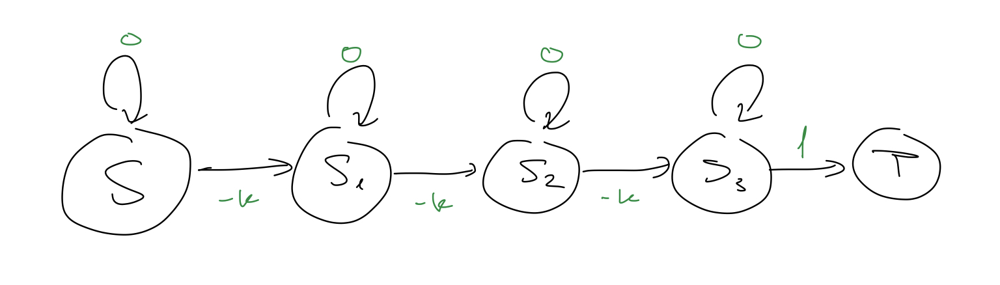
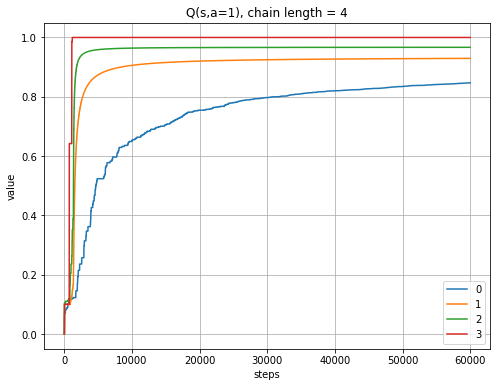
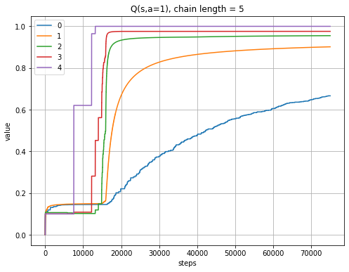
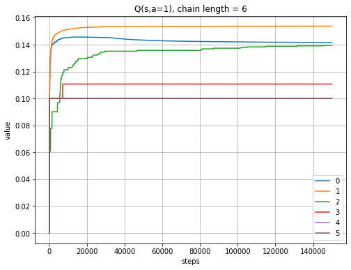
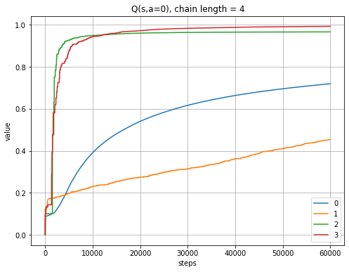
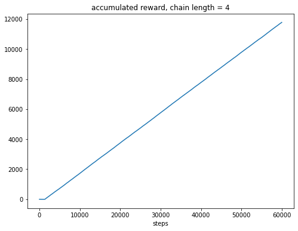
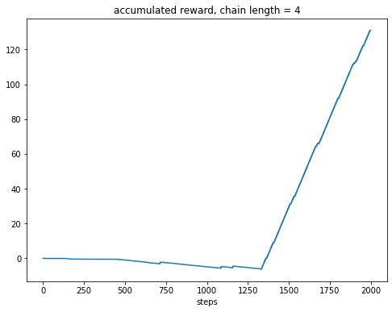
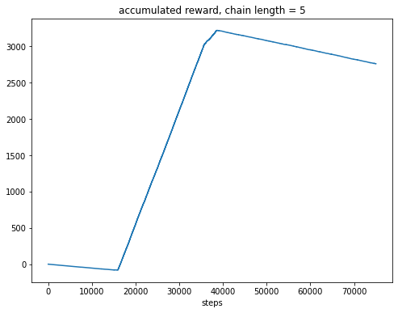
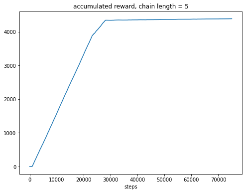

# LSVI-UCB
An implementation of the algorithm presented in the paper 
[Provably Efficient Reinforcement Learning with Linear Function Approximation](https://arxiv.org/pdf/1907.05388.pdf).  
The code was built on top of Alex Ayoub's repo [Exploration-in-RL](https://github.com/aa14k/Exploration-in-RL).  

### Important notes
1. The algorithm is very sensetive to the choise of beta  
2. Only when we added epsilon greedy we managed to get decent results  

### Prerequisites
```
python > 3.8
numpy==1.23.1
```

### MDP - RiverSwim


  
A **deterministic** 1D state cahin with two possible actions:  
0 - Stay on the same state  
1 - Move right  
The rewards are 0 for all 0 actions (r(s,a=0)=0), a small negative reward ("-k" in the drawing, order of 0.1 or 0.01) for 1 actions in all states except of the state before the terminal state, and reward of 1 transitioning to the terminal state.  
The green marks in the drawing above are the reward of the MDP.


## Experiments
- State-action values of Q(s, a=1) for different chain lengths.

1. Chain length: 4  
  
For earlier states it takes more steps to reach their true value.  
2. Chain length: 5  
  
It takes more steps for longer chains to converge.  
3. Chain length: 6  


- For Q(s, a=0), the algorithm failed to reach 0 value for all states:  

  
- Rewards  
1. Chain length: 4  
  
Zoom in on the early steps:  

2. Chain length: 5  
  
If we reduce the negative reward in a factor of 10:  



### Next steps  
experiment with other VI based algorithms.  
